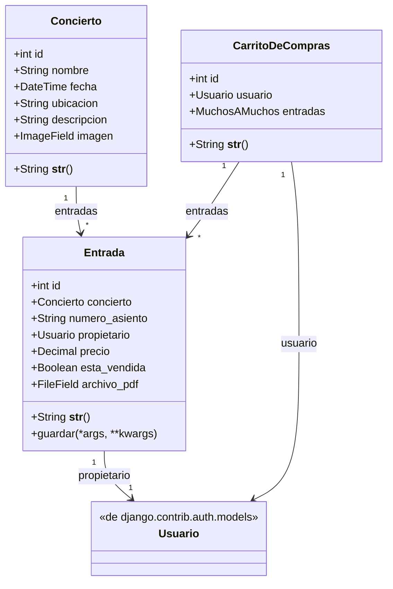
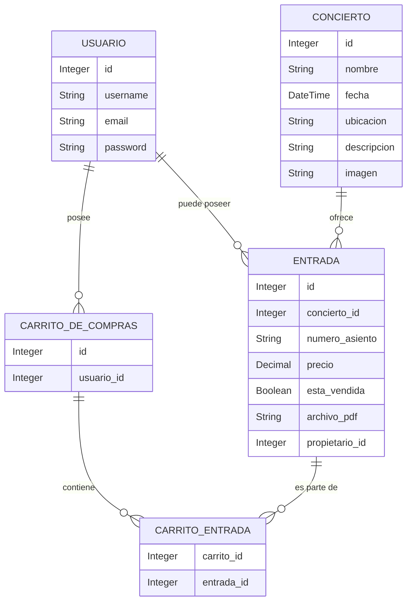

# Proyecto: Carrito de Compras para Entradas de Conciertos 🎟️

Este proyecto es una tienda en línea desarrollada con Django que permite a los usuarios comprar entradas para conciertos. 

### Características principales:
- Explorar conciertos disponibles con detalles como fecha, ubicación y descripción.
- Comprar entradas para conciertos y descargar PDF de la compra.
- Gestionar conciertos y entradas desde un panel administrador.
- Gestionar usuaarios desde un panel administrador.

---

## Instalación 🚀

Sigue los pasos a continuación para configurar y ejecutar el proyecto en tu entorno local.

```bash
# 1. Clona el repositorio
git clone <URL-del-repositorio>
cd <nombre-del-repositorio>

# 2. Configura un entorno virtual
# En Linux/Mac:
python -m venv env
source env/bin/activate
# En Windows:
python -m venv env
env\Scripts\activate

# 3. Instala las dependencias
pip install -r requirements.txt

# 4. Configura la base de datos
python manage.py makemigrations
python manage.py migrate

# 5. Crea un superusuario
python manage.py createsuperuser

# 6. Inicia el servidor
python manage.py runserver

# Accede al proyecto en tu navegador:
# http://127.0.0.1:8000
```
### Diagrama de Clases



### Diagrama de Secuencia

```mermaid
sequenceDiagram
    participant Usuario
    participant Navegador
    participant ServidorDjango
    participant BaseDeDatos

    Usuario->>Navegador: Accede al sitio web
    Navegador->>ServidorDjango: Solicita la lista de conciertos (/concerts/)
    ServidorDjango->>BaseDeDatos: Obtiene los datos de los conciertos
    BaseDeDatos-->>ServidorDjango: Retorna los conciertos
    ServidorDjango-->>Navegador: Devuelve la lista de conciertos
    Navegador-->>Usuario: Muestra los conciertos disponibles

    Usuario->>Navegador: Selecciona un concierto y visualiza detalles
    Navegador->>ServidorDjango: Solicita detalles del concierto (/concert/<id>/)
    ServidorDjango->>BaseDeDatos: Obtiene los datos del concierto
    BaseDeDatos-->>ServidorDjango: Retorna los detalles del concierto
    ServidorDjango-->>Navegador: Devuelve los detalles del concierto
    Navegador-->>Usuario: Muestra los detalles del concierto

    Usuario->>Navegador: Agrega una entrada al carrito
    Navegador->>ServidorDjango: Solicita agregar la entrada al carrito (/cart/add/<id>/)
    ServidorDjango->>BaseDeDatos: Agrega la entrada al carrito del usuario
    BaseDeDatos-->>ServidorDjango: Confirma la operación
    ServidorDjango-->>Navegador: Actualiza el estado del carrito
    Navegador-->>Usuario: Muestra que la entrada fue añadida al carrito

    Usuario->>Navegador: Procede a la compra
    Navegador->>ServidorDjango: Solicita procesar el pago (/checkout/)
    ServidorDjango->>BaseDeDatos: Actualiza el estado de las entradas como vendidas
    BaseDeDatos-->>ServidorDjango: Confirma la operación
    ServidorDjango-->>Navegador: Confirma la compra
    Navegador-->>Usuario: Muestra confirmación de la compra
```



### Diagrama Entidad-Relación



### Diccionario de Datos

```markdown
#### Tabla `USUARIO`
- **id**: Integer - Identificador único del usuario.
- **username**: String - Nombre de usuario.
- **email**: String - Correo electrónico del usuario.
- **password**: String - Contraseña del usuario.

#### Tabla `CONCIERTO`
- **id**: Integer - Identificador único del concierto.
- **nombre**: String - Nombre del concierto.
- **fecha**: DateTime - Fecha y hora del concierto.
- **ubicacion**: String - Lugar donde se llevará a cabo el concierto.
- **descripcion**: String - Detalles adicionales sobre el concierto.
- **imagen**: String - Ruta de la imagen del concierto.

#### Tabla `ENTRADA`
- **id**: Integer - Identificador único de la entrada.
- **concierto_id**: Integer - Referencia al concierto asociado.
- **numero_asiento**: String - Número de asiento asignado.
- **precio**: Decimal - Precio de la entrada.
- **esta_vendida**: Boolean - Indica si la entrada ya fue vendida.
- **archivo_pdf**: String - Ruta al archivo PDF de la entrada.
- **propietario_id**: Integer - Referencia al usuario propietario.

#### Tabla `CARRITO_DE_COMPRAS`
- **id**: Integer - Identificador único del carrito.
- **usuario_id**: Integer - Referencia al usuario propietario del carrito.

#### Tabla `CARRITO_ENTRADA`
- **carrito_id**: Integer - Referencia al carrito de compras.
- **entrada_id**: Integer - Referencia a la entrada asociada al carrito.

